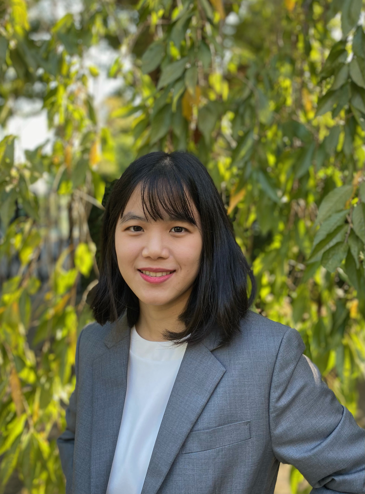

:::: {style="display: grid; grid-template-columns: 1fr 1fr; grid-column-gap: 10px;"}

::: {}
Hi! I'm Saisawat Samutpradit. I'm a Ph.D. candidate in economics at the University of Tokyo. My research interests are in labor and development economics. I am on the 2022-2023 job market and will be available for virtual interviews at any time.

\
\
\

### `r fontawesome::fa("bullhorn")` News
I will be available in person at the [AASLE2022 Tokyo Conference](https://www.aasle.org/tokyo-job-market-candidates).
:::

::: {}
```{r, echo=FALSE, out.width = '50%', fig.align='center'}
library(knitr)

```
:::

::::
